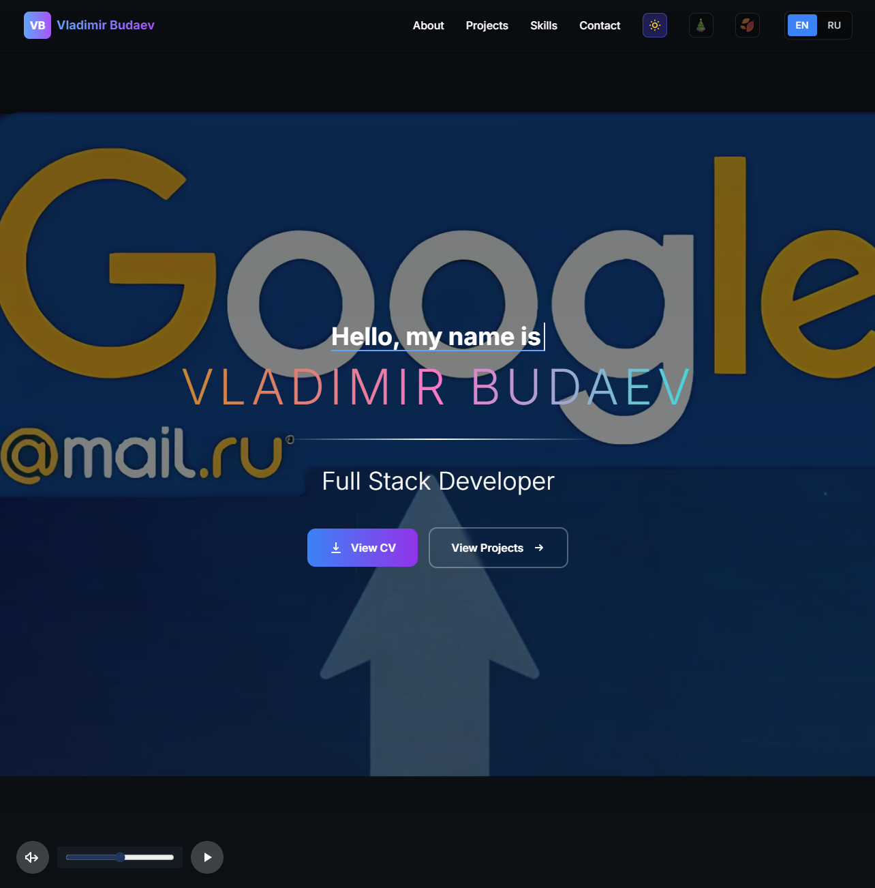
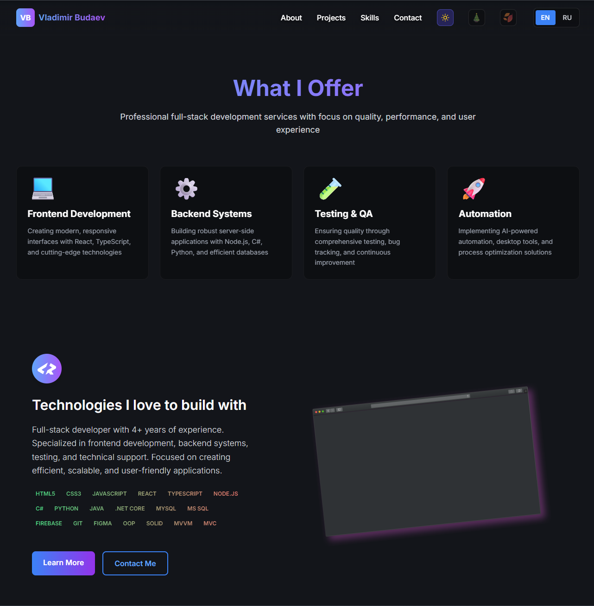
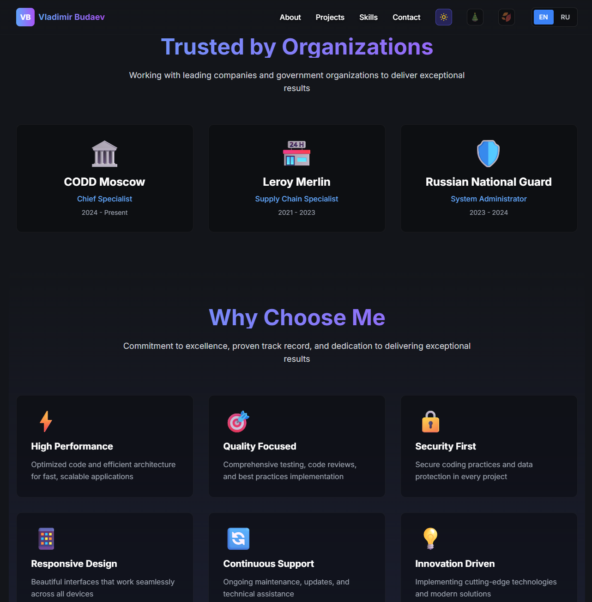
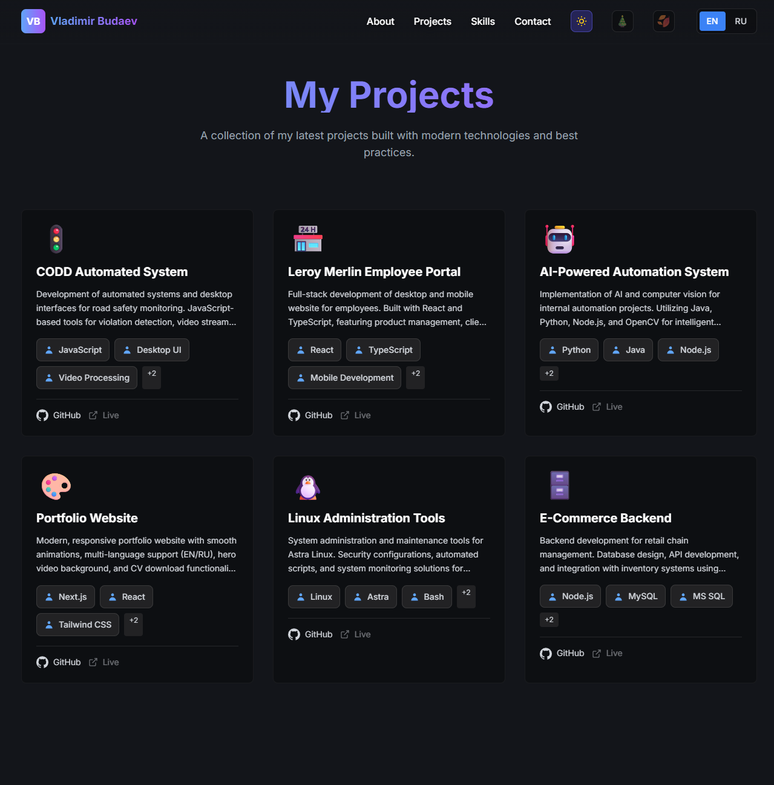
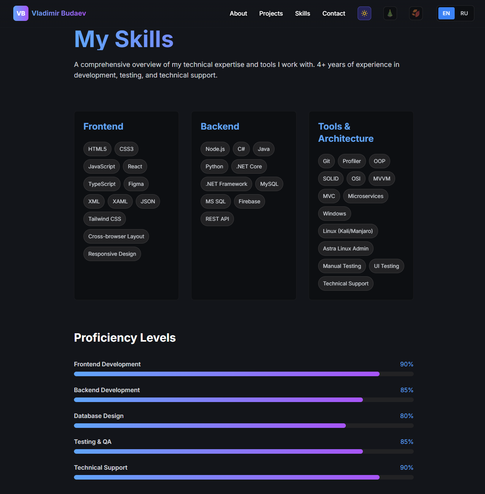
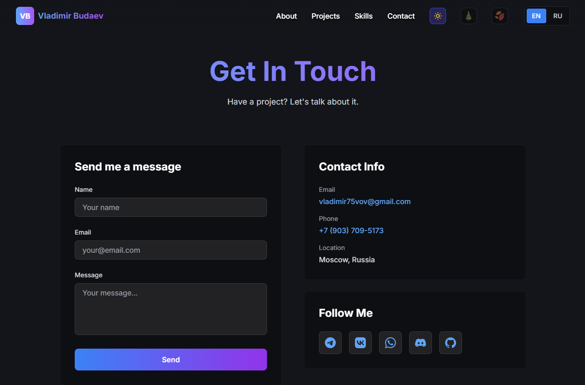

# 🚀 Portfolio Website - Vladimir Budaev

**Современный адаптивный веб-сайт портфолио | Modern Responsive Portfolio Website**

[](https://nextjs.org/)
[](https://reactjs.org/)
[](https://tailwindcss.com/)
[](LICENSE)

**🌐 Live Demo:** [vladimir75vov.github.io/portfolio](https://vladimir75vov.github.io/portfolio/)


#### Профессиональное вступление с чистым, современным дизайном: заголовок и слоган, которые передают суть специалиста | Professional introduction with a clean, modern design, headline and tagline that captures the professional’s essence

#### Обзор ключевых услуг и ценностного предложения: навыки и решения представлены с помощью иконок и кратких описаний — с акцентом на выгоды для клиента | Overview of core services and value proposition: skills and solutions presented via icons and short descriptions, focusing on client benefits

#### Раздел, подтверждающий надёжность: логотипы компаний и клиентов, с которыми работал специалист, — социальное доказательство компетентности и надёжности | Credibility section featuring logos of companies and clients the professional has worked with — social proof of reliability

#### Портфолио завершённых проектов: миниатюры изображений, названия и краткие описания, демонстрирующие опыт и результаты, достигнутые для клиентов | Showcase of completed projects: thumbnail images, titles and brief descriptions demonstrating experience and results delivered to clients

#### Краткий обзор ключевых компетенций с использованием иконок, прогресс‑баров или оценок — демонстрирует технические навыки, мягкие навыки (soft skills) и области специализации | Snapshot of key competencies using icons, progress bars or ratings — shows technical abilities, soft skills and areas of specialization

#### Раздел контактов: электронная почта, телефон, ссылки на соцсети и/или форма обратной связи — мотивирует посетителей связаться для сотрудничества | Contact section with email, phone, social media links and/or contact form — encourages visitors to reach out for collaboration
---

## 📋 Содержание | Table of Contents

- [🇷🇺 Русский](#russian)
  - [О проекте](#about-ru)
  - [Особенности](#features-ru)
  - [Технологии](#tech-ru)
  - [Установка и запуск](#installation-ru)
  - [Структура проекта](#structure-ru)
  - [Конфигурация](#config-ru)
  - [Разработка](#development-ru)
  - [Деплой](#deploy-ru)
- [🇬🇧 English](#english)
  - [About](#about-en)
  - [Features](#features-en)
  - [Technologies](#tech-en)
  - [Installation](#installation-en)
  - [Project Structure](#structure-en)
  - [Configuration](#config-en)
  - [Development](#development-en)
  - [Deployment](#deploy-en)

---

<a name="russian"></a>
## 🇷🇺 Русский

<a name="about-ru"></a>
### 📖 О проекте

Профессиональный веб-сайт портфолио, созданный с использованием современных технологий. Проект демонстрирует навыки full-stack разработки и включает интерактивные элементы, адаптивный дизайн и поддержку двух языков.

**Основные возможности:**
- ⚡ Высокая производительность благодаря Next.js 15
- 🎨 Современный UI с плавными анимациями
- 🌍 Поддержка русского и английского языков
- 📱 Полностью адаптивный дизайн
- 🎭 Сезонные темы (Рождество, Осень) с автоматическим определением
- 🌓 Темная и светлая темы
- 📄 Просмотр и скачивание резюме в HTML формате

<a name="features-ru"></a>
### ✨ Особенности

#### 🎯 Функциональность
- **Многоязычность**: Автоматическое определение языка браузера + ручное переключение EN/RU
- **Система тем**: 
  - Светлая/темная тема с сохранением в localStorage
  - Рождественская тема с анимацией снега (18 снежинок)
  - Осенняя тема с падающими листьями (18 листьев)
  - Автоматический выбор сезонной темы по месяцу
  - Динамическое изменение цвета адресной строки браузера
- **Резюме**: Просмотр CV в новой вкладке на русском и английском
- **Видео-фон**: Hero-секция с фоновым видео и управлением звуком
- **Навигация**: Адаптивное меню с автозакрытием на мобильных устройствах
- **Анимации**: Эффект печатающейся машинки, градиентные анимации, плавные переходы
- **SEO**: Полная оптимизация метаданных, Open Graph, Twitter Cards

#### 📄 Страницы
1. **Главная (Home)**: Hero-секция с видео, краткое представление
2. **О себе (About)**: Биография, возраст (автоматический расчет), образование
3. **Проекты (Projects)**: Карточки проектов с технологиями и ссылками
4. **Навыки (Skills)**: Технологический стек, уровень владения инструментами
5. **Контакты (Contact)**: Форма связи, социальные сети

#### 🎨 Дизайн
- Адаптивная верстка для всех устройств (320px - 4K)
- Градиентные эффекты и анимации
- Backdrop blur эффекты
- Сезонные декорации (елки, листья, подарки)
- Фильтры яркости для видимости на темном фоне

<a name="tech-ru"></a>
### 🛠️ Технологии

**Frontend:**
- **Next.js 15.5.7** - React фреймворк с App Router
- **React 18.3.1** - Библиотека для UI
- **Tailwind CSS 3.4.15** - Utility-first CSS фреймворк
- **SCSS** - CSS препроцессор для глобальных стилей
- **React Icons** - Библиотека иконок

**Инструменты разработки:**
- **ESLint** - Линтер кода (Airbnb config)
- **Prettier** - Форматирование кода
- **kill-port** - Автоматическое освобождение портов

**Деплой:**
- **GitHub Pages** - Статический хостинг
- **GitHub Actions** - CI/CD автоматизация

<a name="installation-ru"></a>
### 📥 Установка и запуск

#### Предварительные требования
- Node.js 18.17 или выше
- npm или yarn

#### Шаги установки

1. **Клонирование репозитория**
```bash
git clone https://github.com/vladimir75vov/portfolio.git
cd portfolio/frontend
```

2. **Установка зависимостей**
```bash
npm install
```

3. **Запуск dev-сервера**
```bash
npm run dev
```
Приложение будет доступно по адресу: `http://localhost:3000`

4. **Сборка для production**
```bash
npm run build
```

5. **Локальный просмотр production версии**
```bash
npm start
```

<a name="structure-ru"></a>
### 📁 Структура проекта

```
portfolio/
├── frontend/
│   ├── app/                    # Next.js App Router
│   │   ├── _files/            # Скрипты (startup.js для автозапуска)
│   │   ├── about/             # Страница "Обо мне"
│   │   ├── contact/           # Страница контактов
│   │   ├── home/              # Главная страница
│   │   │   └── _elements/     # Компоненты секций (section1-5, video, typewriter)
│   │   ├── projects/          # Страница проектов
│   │   ├── skills/            # Страница навыков
│   │   └── layout.jsx         # Корневой layout с метаданными
│   │
│   ├── components/            # Переиспользуемые компоненты
│   │   ├── layout/           # Navbar, Footer
│   │   ├── LoadingScreen.jsx # Экран загрузки
│   │   ├── projectCard.jsx   # Карточка проекта
│   │   ├── techBadge.jsx     # Бейдж технологии
│   │   ├── ThemeColor.jsx    # Динамический цвет браузера
│   │   └── typeWriterComp.jsx # Эффект печати
│   │
│   ├── context/              # React Context провайдеры
│   │   ├── LanguageContext.jsx # Управление языком (EN/RU + переводы)
│   │   └── ThemeContext.jsx    # Управление темами (dark/light + seasonal)
│   │
│   ├── public/               # Статические файлы
│   │   ├── cv/              # Резюме (cvEn.html, cvRu.html)
│   │   ├── images/          # Изображения (Christmas tree.png, og-image.svg)
│   │   ├── video/           # Видео для hero-секции
│   │   ├── favicon.ico
│   │   ├── manifest.json    # PWA манифест
│   │   └── .nojekyll        # Для GitHub Pages
│   │
│   ├── resources/
│   │   └── styles/
│   │       └── globals.scss  # Глобальные стили, темы, анимации
│   │
│   ├── .eslintrc.json       # Конфигурация ESLint
│   ├── next.config.mjs      # Конфигурация Next.js
│   ├── package.json         # Зависимости и скрипты
│   ├── postcss.config.mjs   # PostCSS конфигурация
│   └── tailwind.config.js   # Tailwind конфигурация
│
├── backend/                  # Backend (Node.js API - в разработке)
├── database/                 # База данных (в разработке)
├── .github/
│   └── workflows/
│       └── nextjs.yml       # GitHub Actions для деплоя
└── startBackAndFront.bat    # Скрипт запуска backend + frontend
```

<a name="config-ru"></a>
### ⚙️ Конфигурация

#### next.config.mjs
```javascript
{
  output: 'export',              // Статический экспорт для GitHub Pages
  basePath: '/portfolio',        // Базовый путь для GitHub Pages
  assetPrefix: '/portfolio',     // Префикс для ассетов
  images: { unoptimized: true }, // Отключение оптимизации изображений
  trailingSlash: true            // Слэш в конце URL
}
```

#### Переменные окружения
Создайте `.env.local` (опционально для Telegram):
```env
NEXT_PUBLIC_TELEGRAM_BOT_TOKEN=your_bot_token
NEXT_PUBLIC_TELEGRAM_CHAT_ID=your_chat_id
NEXT_PUBLIC_BASE_PATH=/portfolio
```

#### Темы (globals.scss)
- **Базовые темы**: `--bg-primary`, `--text-primary` для dark/light
- **Рождественская тема**: `.christmas-theme` (зеленые тона, снег)
- **Осенняя тема**: `.autumn-theme` (коричневые тона, листья)
- **Анимации**: `@keyframes snowfall`, `@keyframes leafFall`

<a name="development-ru"></a>
### 💻 Разработка

#### Добавление нового языка

1. Откройте `frontend/context/LanguageContext.jsx`
2. Добавьте переводы в объект `translations`:
```javascript
const translations = {
  en: { /* ... */ },
  ru: { /* ... */ },
  de: { /* новые переводы */ }
};
```
3. Добавьте флаг в `LanguageSwitcher` компонент

#### Создание новой страницы

1. Создайте папку в `frontend/app/`:
```bash
mkdir frontend/app/new-page
```

2. Создайте `page.jsx`:
```javascript
"use client";
export default function NewPage() {
  return <div>New Page</div>;
}
```

3. Добавьте ссылку в `Navbar` и `Footer`

#### Добавление проекта

Откройте `frontend/app/projects/page.jsx` и добавьте в массив `projects`:
```javascript
{
  id: 5,
  titleEn: "Project Title",
  titleRu: "Название проекта",
  descriptionEn: "Description",
  descriptionRu: "Описание",
  technologies: ["React", "Node.js"],
  github: "https://github.com/...",
  live: "https://...",
  image: "🚀"
}
```

#### Изменение сезонных тем

Файл `frontend/context/ThemeContext.jsx`:
- `getCurrentSeason()` - логика определения сезона
- Месяцы: Зима (11,0,1), Весна (2-4), Лето (5-7), Осень (8-10)

<a name="deploy-ru"></a>
### 🚀 Деплой

#### GitHub Pages (автоматический)

1. **Настройка репозитория**
   - Откройте Settings → Pages
   - Source: GitHub Actions

2. **Пуш кода**
```bash
git add .
git commit -m "Update portfolio"
git push origin master
```

3. **Автоматический деплой**
   - GitHub Actions запустит workflow из `.github/workflows/nextjs.yml`
   - Сайт будет доступен через 2-3 минуты

#### Ручной деплой

```bash
cd frontend
npm run build
# Загрузите содержимое папки 'out' на хостинг
```

#### Проверка деплоя

1. Откройте Actions в GitHub
2. Дождитесь зеленой галочки ✅
3. Перейдите на `https://vladimir75vov.github.io/portfolio/`

---

<a name="english"></a>
## 🇬🇧 English

<a name="about-en"></a>
### 📖 About

Professional portfolio website built with modern technologies. The project demonstrates full-stack development skills and includes interactive elements, responsive design, and multi-language support.

**Key Capabilities:**
- ⚡ High performance with Next.js 15
- 🎨 Modern UI with smooth animations
- 🌍 Russian and English language support
- 📱 Fully responsive design
- 🎭 Seasonal themes (Christmas, Autumn) with auto-detection
- 🌓 Dark and light themes
- 📄 View and download CV in HTML format

<a name="features-en"></a>
### ✨ Features

#### 🎯 Functionality
- **Multilingual**: Auto-detect browser language + manual EN/RU toggle
- **Theme System**: 
  - Light/dark theme with localStorage persistence
  - Christmas theme with snow animation (18 snowflakes)
  - Autumn theme with falling leaves (18 leaves)
  - Auto-select seasonal theme by month
  - Dynamic browser address bar color change
- **Resume**: View CV in new tab in Russian and English
- **Video Background**: Hero section with background video and audio controls
- **Navigation**: Responsive menu with auto-close on mobile
- **Animations**: Typewriter effect, gradient animations, smooth transitions
- **SEO**: Full metadata optimization, Open Graph, Twitter Cards

#### 📄 Pages
1. **Home**: Hero section with video, brief introduction
2. **About**: Biography, age (auto-calculated), education
3. **Projects**: Project cards with technologies and links
4. **Skills**: Tech stack, tool proficiency levels
5. **Contact**: Contact form, social media links

#### 🎨 Design
- Responsive layout for all devices (320px - 4K)
- Gradient effects and animations
- Backdrop blur effects
- Seasonal decorations (trees, leaves, gifts)
- Brightness filters for dark background visibility

<a name="tech-en"></a>
### 🛠️ Technologies

**Frontend:**
- **Next.js 15.5.7** - React framework with App Router
- **React 18.3.1** - UI library
- **Tailwind CSS 3.4.15** - Utility-first CSS framework
- **SCSS** - CSS preprocessor for global styles
- **React Icons** - Icon library

**Development Tools:**
- **ESLint** - Code linter (Airbnb config)
- **Prettier** - Code formatter
- **kill-port** - Auto port cleanup

**Deployment:**
- **GitHub Pages** - Static hosting
- **GitHub Actions** - CI/CD automation

<a name="installation-en"></a>
### 📥 Installation

#### Prerequisites
- Node.js 18.17 or higher
- npm or yarn

#### Installation Steps

1. **Clone repository**
```bash
git clone https://github.com/vladimir75vov/portfolio.git
cd portfolio/frontend
```

2. **Install dependencies**
```bash
npm install
```

3. **Run dev server**
```bash
npm run dev
```
Application will be available at: `http://localhost:3000`

4. **Build for production**
```bash
npm run build
```

5. **Preview production build**
```bash
npm start
```

<a name="structure-en"></a>
### 📁 Project Structure

```
portfolio/
├── frontend/
│   ├── app/                    # Next.js App Router
│   │   ├── _files/            # Scripts (startup.js for auto-start)
│   │   ├── about/             # About page
│   │   ├── contact/           # Contact page
│   │   ├── home/              # Home page
│   │   │   └── _elements/     # Section components (section1-5, video, typewriter)
│   │   ├── projects/          # Projects page
│   │   ├── skills/            # Skills page
│   │   └── layout.jsx         # Root layout with metadata
│   │
│   ├── components/            # Reusable components
│   │   ├── layout/           # Navbar, Footer
│   │   ├── LoadingScreen.jsx # Loading screen
│   │   ├── projectCard.jsx   # Project card
│   │   ├── techBadge.jsx     # Technology badge
│   │   ├── ThemeColor.jsx    # Dynamic browser color
│   │   └── typeWriterComp.jsx # Typing effect
│   │
│   ├── context/              # React Context providers
│   │   ├── LanguageContext.jsx # Language management (EN/RU + translations)
│   │   └── ThemeContext.jsx    # Theme management (dark/light + seasonal)
│   │
│   ├── public/               # Static files
│   │   ├── cv/              # Resumes (cvEn.html, cvRu.html)
│   │   ├── images/          # Images (Christmas tree.png, og-image.svg)
│   │   ├── video/           # Video for hero section
│   │   ├── favicon.ico
│   │   ├── manifest.json    # PWA manifest
│   │   └── .nojekyll        # For GitHub Pages
│   │
│   ├── resources/
│   │   └── styles/
│   │       └── globals.scss  # Global styles, themes, animations
│   │
│   ├── .eslintrc.json       # ESLint config
│   ├── next.config.mjs      # Next.js config
│   ├── package.json         # Dependencies and scripts
│   ├── postcss.config.mjs   # PostCSS config
│   └── tailwind.config.js   # Tailwind config
│
├── backend/                  # Backend (Node.js API - in development)
├── database/                 # Database (in development)
├── .github/
│   └── workflows/
│       └── nextjs.yml       # GitHub Actions for deployment
└── startBackAndFront.bat    # Script to run backend + frontend
```

<a name="config-en"></a>
### ⚙️ Configuration

#### next.config.mjs
```javascript
{
  output: 'export',              // Static export for GitHub Pages
  basePath: '/portfolio',        // Base path for GitHub Pages
  assetPrefix: '/portfolio',     // Prefix for assets
  images: { unoptimized: true }, // Disable image optimization
  trailingSlash: true            // Trailing slash in URLs
}
```

#### Environment Variables
Create `.env.local` (optional for Telegram):
```env
NEXT_PUBLIC_TELEGRAM_BOT_TOKEN=your_bot_token
NEXT_PUBLIC_TELEGRAM_CHAT_ID=your_chat_id
NEXT_PUBLIC_BASE_PATH=/portfolio
```

#### Themes (globals.scss)
- **Base themes**: `--bg-primary`, `--text-primary` for dark/light
- **Christmas theme**: `.christmas-theme` (green tones, snow)
- **Autumn theme**: `.autumn-theme` (brown tones, leaves)
- **Animations**: `@keyframes snowfall`, `@keyframes leafFall`

<a name="development-en"></a>
### 💻 Development

#### Adding New Language

1. Open `frontend/context/LanguageContext.jsx`
2. Add translations to `translations` object:
```javascript
const translations = {
  en: { /* ... */ },
  ru: { /* ... */ },
  de: { /* new translations */ }
};
```
3. Add flag to `LanguageSwitcher` component

#### Creating New Page

1. Create folder in `frontend/app/`:
```bash
mkdir frontend/app/new-page
```

2. Create `page.jsx`:
```javascript
"use client";
export default function NewPage() {
  return <div>New Page</div>;
}
```

3. Add link to `Navbar` and `Footer`

#### Adding Project

Open `frontend/app/projects/page.jsx` and add to `projects` array:
```javascript
{
  id: 5,
  titleEn: "Project Title",
  titleRu: "Название проекта",
  descriptionEn: "Description",
  descriptionRu: "Описание",
  technologies: ["React", "Node.js"],
  github: "https://github.com/...",
  live: "https://...",
  image: "🚀"
}
```

#### Customizing Seasonal Themes

File `frontend/context/ThemeContext.jsx`:
- `getCurrentSeason()` - season detection logic
- Months: Winter (11,0,1), Spring (2-4), Summer (5-7), Autumn (8-10)

<a name="deploy-en"></a>
### 🚀 Deployment

#### GitHub Pages (automatic)

1. **Repository Setup**
   - Open Settings → Pages
   - Source: GitHub Actions

2. **Push Code**
```bash
git add .
git commit -m "Update portfolio"
git push origin master
```

3. **Automatic Deployment**
   - GitHub Actions will run workflow from `.github/workflows/nextjs.yml`
   - Site will be live in 2-3 minutes

#### Manual Deployment

```bash
cd frontend
npm run build
# Upload contents of 'out' folder to hosting
```

#### Verify Deployment

1. Open Actions in GitHub
2. Wait for green checkmark ✅
3. Navigate to `https://vladimir75vov.github.io/portfolio/`

---

## 📝 License

MIT License - see [LICENSE](LICENSE) file for details.

## 👤 Author

**Vladimir Budaev**
- GitHub: [@vladimir75vov](https://github.com/vladimir75vov)
- Portfolio: [vladimir75vov.github.io/portfolio](https://vladimir75vov.github.io/portfolio/)

## 🙏 Acknowledgments

- Next.js team for the amazing framework
- Tailwind CSS for the utility-first approach
- React Icons for the icon library
- GitHub Pages for free hosting

---

**⭐ If you like this project, please give it a star!**
